# 01. 프로젝트 개요(Project Overview)

**(목표)** Django를 활용한 여행(Travel) 블로그 웹 페이지 제작

**(기간)** 2024.08.26.(월) ~ 2024.09.01.(일), 7일간

**(역할)** 기획/디자인/개발(1인 프로젝트)

# 02. 구현 기능(Implemented Features)
웹 페이지 제작에서 구현한 기능은 아래와 같습니다.

## 가. 기본 기능
### 01) 관리자 계정(Admin)
관리자 전용 페이지를 생성하여 사용자 관리 및 시스템 설정 기능을 구현합니다. 
### 02) 글 생성/읽기/수정/삭제(CRUD)
게시글의 생성, 조회, 수정, 삭제 기능을 구현합니다.
### 03) 사용자 인증(Auth)
사용자 로그인 및 회원가입 기능을 구현하고 데코레이터도 사용자별 권한을 지정합니다.

## 나. 추가 기능
### 01) 파일 업로드(Upload file)
사용자가 서버에 파일을 업로드하고 관리할 수 있도록 파일 처리 기능을 구현합니다.
### 02) 댓글(comment)
게시글에 댓글을 추가, 수정, 삭제할 수 있는 기능을 구현하여 사용자 간의 상호작용을 지원합니다.

# 03. WBS(Work Breakdown Structure)

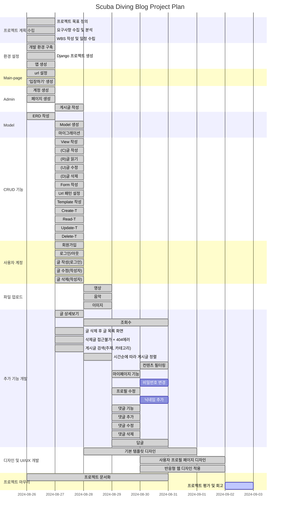

# 04. 구조도(Structure)

## 웹페이지 서비스 구조도
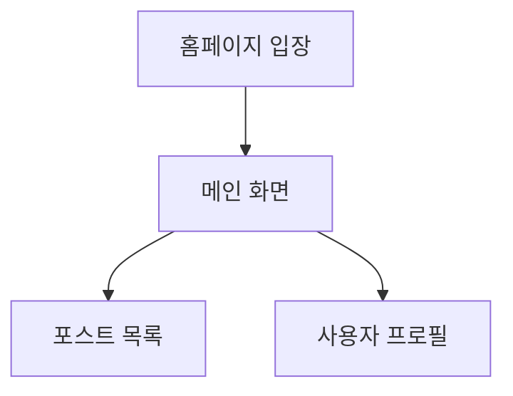
## 기능 구조도
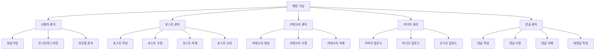

# 05. ERD(Entity Relationship Diagram)
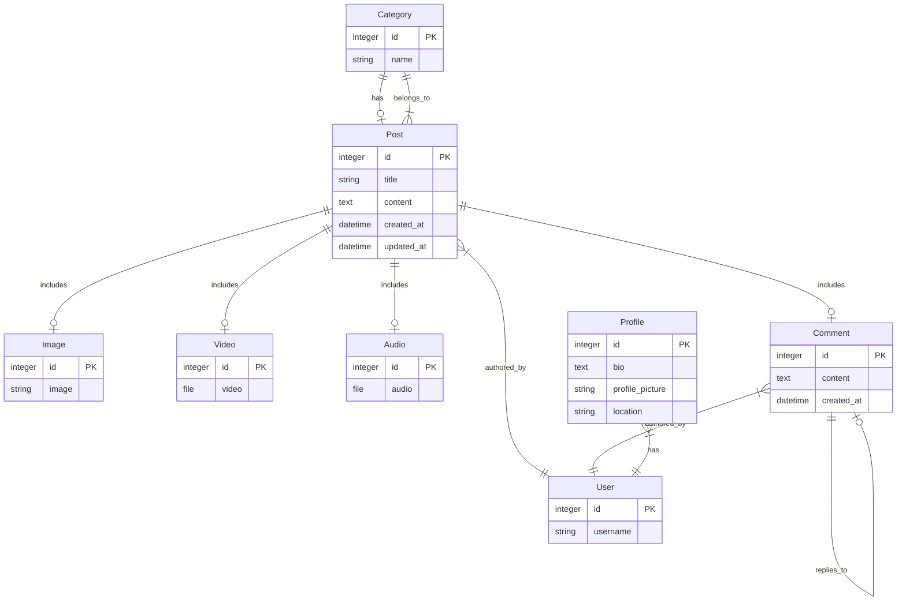

# 06. 배포(Release)
- 미진행

# 07. 관련 화면(Demo Version)

| 카테고리      | 기능                   | 설명                  | 영상/이미지              |
|---------------|------------------------|-----------------------|-------------------|
| **메인화면**   | 입장                   | 앱의 시작 화면 |    |
|               | 메인페이지             | 블로그의 주요 페이지 |  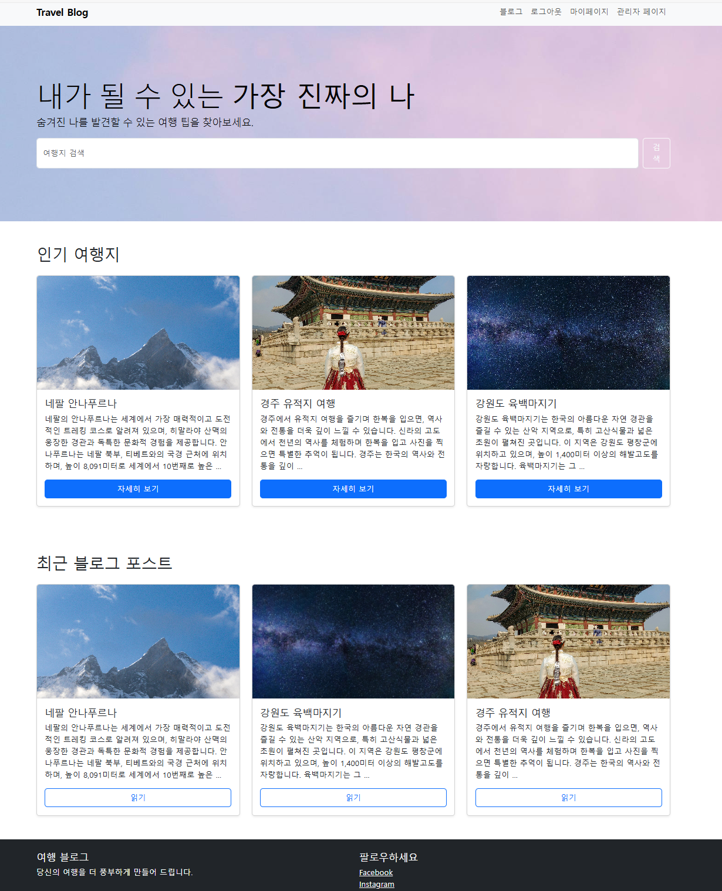  |
| **사용자**     | 로그인                 | 사용자의 로그인 절차 | 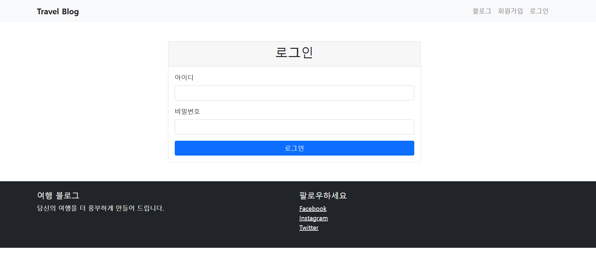   |
|               | 회원가입               | 사용자의 회원가입 | 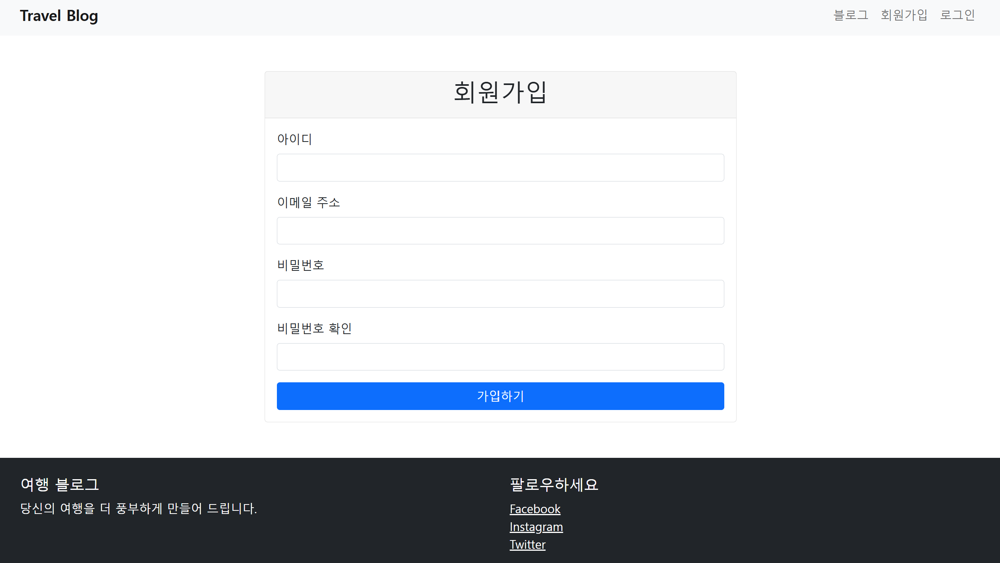 |
|               | 마이페이지               | 사용자의 마이페이지 | 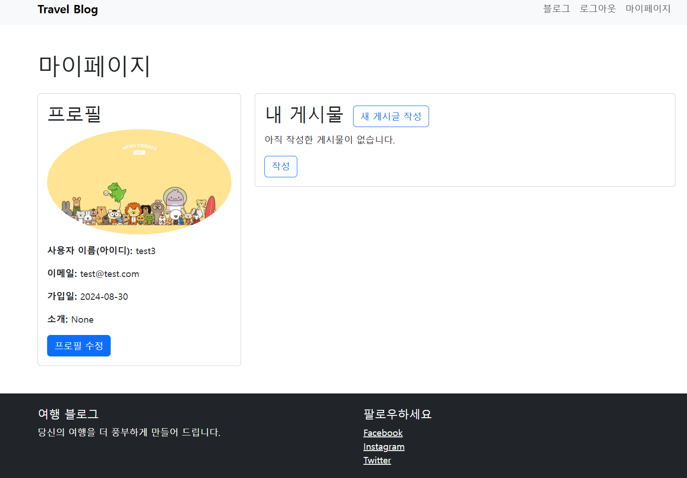 |
|               | 프로필 수정               | 사용자의 프로필 수정 | 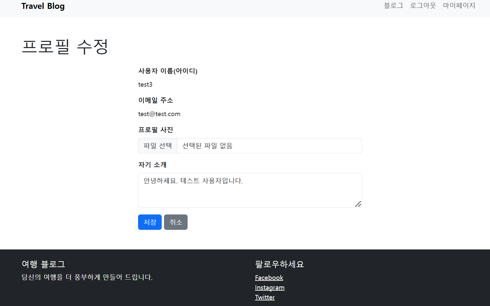 |
|               | 게시글 작성              | 블로그 게시글 관련 기능 | 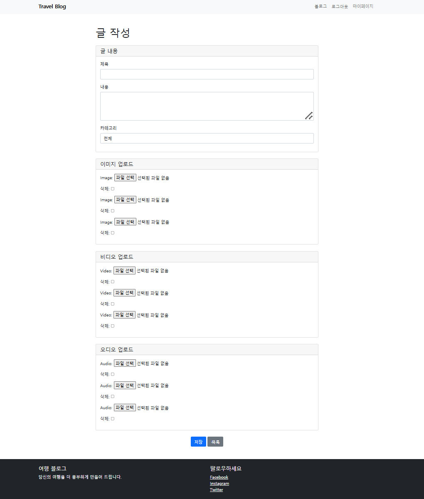  |
|               | 게시글 내용                | 작성한 게시글 확인 | 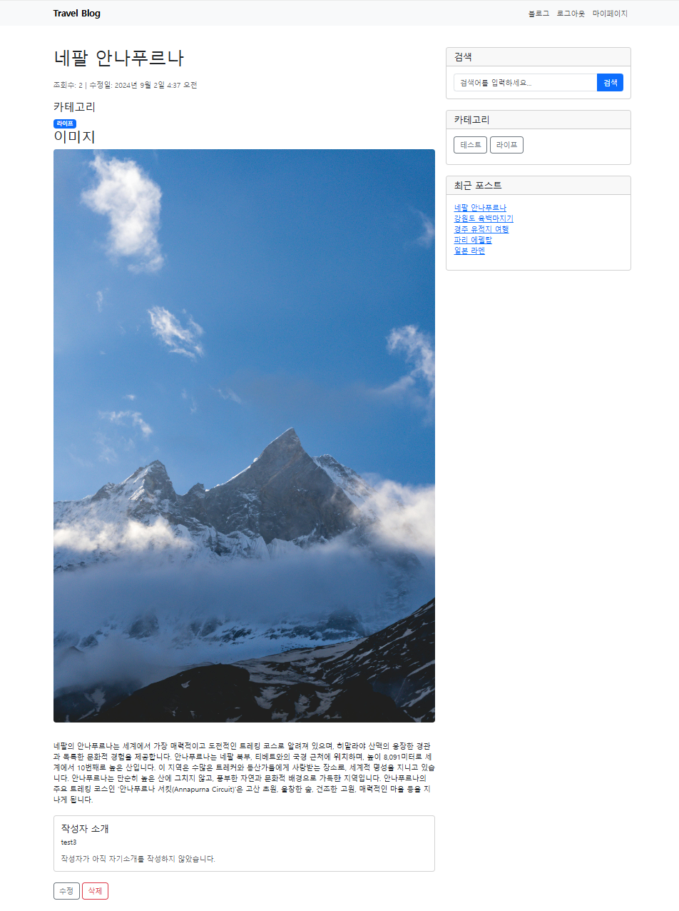   |
|               | 댓글              | 댓글을 작성/수정/삭제 | 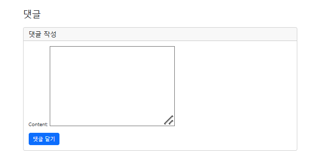   |
| **관리자**     | 관리자페이지           | 관리자 페이지의 기능 | 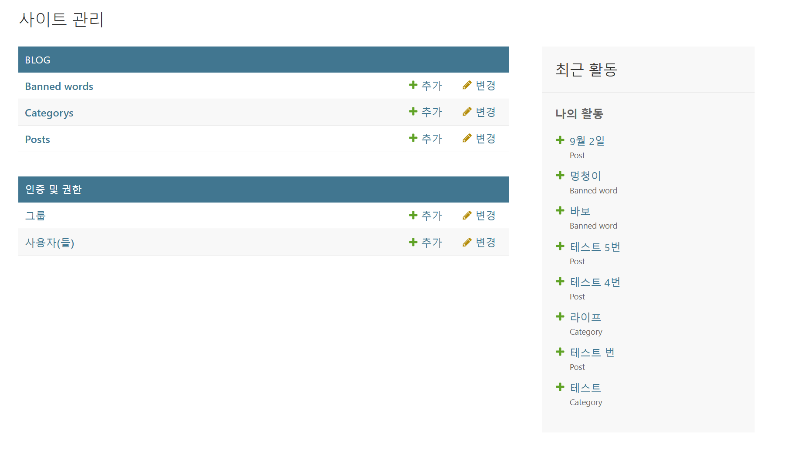   |

# 08. 기술 스택(Tech Stack)

| 카테고리          | 기술 스택                | 설명                                                |
|------------------|--------------------------|-----------------------------------------------------|
| **백엔드 (Backend)**   | Django (Python)       | ORM, 관리자 인터페이스, URL 라우팅, 템플릿 엔진 기능 개발 |
| **프론트엔드 (Frontend)** | HTML                 | 블로그 글의 내용과 레이아웃을 설계 |
|                  | CSS                      | 블로그 스타일과 글의 시각적 표현을 스타일링 |
| **데이터 (Database)**     | Lightsql3            | 블로그의 데이터(포스트, 댓글 등)를 저장하고 관리 |
| **문서 (Document)**      | GitHub                | 블로그 프로젝트의 소스 코드를 관리 |
|                  | Mermaid                 | 프로젝트 구조와 데이터 흐름을 문서화 |

# 10. 회고(Retrospect)

아직까지 필요한 개선점
* 검색 기능 구현
* 비밀번호 변경 기능 구현
* 썸네일 기능 구현
* 개발 완료 후 코드 가독성을 높이는 과정 진행
