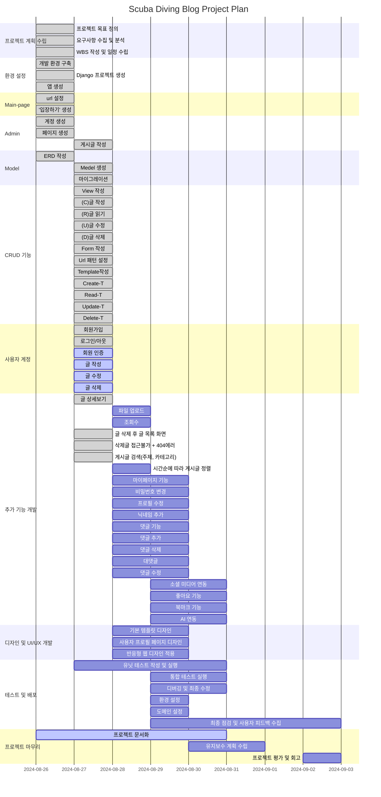
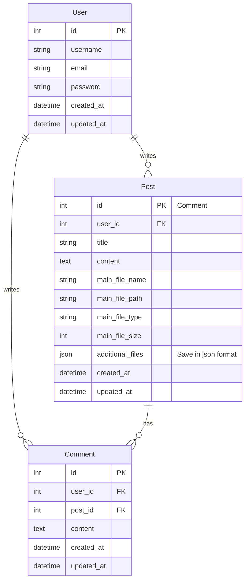

# 01. 프로젝트 개요(Project Overview)

**(목표)** Django를 활용한 여행(Travel) 블로그 웹 페이지 제작

**(기간)** 2024.08.26.(월) ~ 2024.08.30.(금), 5일간

**(역할)** 기획/디자인/개발/배포(1인 프로젝트)

# 02. 구현 기능(Implemented Features)
웹 페이지 제작에서 구현한 기능은 아래와 같습니다.

## 가. 기본 기능
### 01) 관리자 계정(Admin)
### 02) 글 생성/읽기/수정/삭제(CRUD)
### 03) 사용자 인증(Auth)

## 나. 추가 기능
### 01) 파일 업로드(Upload file)
### 02) 댓글(comment)
### 03) 생성형 AI 사용(Using Generative AI)

# 03. WBS(Work Breakdown Structure)

# 04. 웹페이지 구조(Website Structure)

```mermaid
graph TD
    A[메인 페이지 home] --> B[블로그 입장 페이지 enter_blog]
    B --> C[블로그 게시글 목록 post_list]
    C --> D[게시글 상세 post_detail]
    C --> |로그인 사용자|E[게시글 작성 post_create]
    D --> |작성자|F[게시글 수정 post_update]
    D --> |작성자|G[게시글 삭제 post_delete]
    A --> |관리자|H[관리자 페이지 admin]
    H --> I[카테고리 관리 blog_category]
    H --> J[게시글 관리 blog_post]

    subgraph 로그인 사용자 영역
        E
    end

    subgraph 작성자 영역
        F
        G
    end

    subgraph 관리자 영역
        H
        I
        J
    end

    classDef default fill:#001d35,stroke:#333,stroke-width:2px;
    classDef loggedIn fill:#522064,stroke:#333,stroke-width:2px;
    classDef admin fill:#20645f,stroke:#333,stroke-width:2px;
    class E,F,G loggedIn;
    class H,I,J admin;
```

# 05. Wire Frame (with Figma)
- (작성 예정)

# 06. ERD(Entity Relationship Diagram)

# 07. 배포(Release)
- (작성 예정)

# 08. 시연 영상(Demo Version)

| 카테고리      | 기능                   | 설명                  | 영상              |
|---------------|------------------------|-----------------------|-------------------|
| **메인화면**   | 입장                   | 앱의 시작 화면 | (영상 삽입 예정)   |
|               | 메인페이지             | 블로그의 주요 페이지 | (영상 삽입 예정)   |
| **사용자**     | 로그인                 | 사용자의 로그인 절차 | (영상 삽입 예정)   |
|               | 로그아웃               | 사용자의 로그아웃 절차 | (영상 삽입 예정)   |
|               | 게시글                 | 블로그 게시글 관련 기능 |                   |
|               | 글 생성                | 새 게시글을 작성하는 방법 | (영상 삽입 예정)   |
|               | 파일 첨부              | 게시글에 파일을 첨부하는 방법 | (영상 삽입 예정)   |
|               | 글 읽기 (조회 수)       | 게시글을 읽고 조회 수를 확인하는 방법 | (영상 삽입 예정)   |
|               | 글 수정                | 기존 게시글을 수정하는 방법 | (영상 삽입 예정)   |
|               | 글 삭제                | 게시글을 삭제하는 방법 | (영상 삽입 예정)   |
|               | 댓글                   | 댓글 관련 기능 |                   |
|               | 댓글 작성              | 새 댓글을 작성하는 방법 | (영상 삽입 예정)   |
|               | 댓글 수정              | 기존 댓글을 수정하는 방법 | (영상 삽입 예정)   |
|               | 댓글 삭제              | 댓글을 삭제하는 방법 | (영상 삽입 예정)   |
| **관리자**     | 로그인                 | 관리자의 로그인 절차 | (영상 삽입 예정)   |
|               | 로그아웃               | 관리자의 로그아웃 절차 | (영상 삽입 예정)   |
|               | 관리자페이지           | 관리자 페이지의 기능 | (영상 삽입 예정)   |

# 09. 기술 스택(Tech Stack)

| 카테고리          | 기술 스택                | 설명                                                |
|------------------|--------------------------|-----------------------------------------------------|
| **백엔드 (Backend)**   | Django (Python)       | ORM, 관리자 인터페이스, URL 라우팅, 템플릿 엔진 기능 개발 |
| **프론트엔드 (Frontend)** | HTML                 | 블로그 글의 내용과 레이아웃을 설계 |
|                  | CSS                      | 블로그 스타일과 글의 시각적 표현을 스타일링 |
|                  | JavaScript               |  |
| **생성 AI (Generative AI)** | Chat GPT            | 블로그 포스트의 콘텐츠를 생성하거나 작성 |
|                  | Midjourney               | 블로그 포스트에 사용할 이미지를 생성 |
| **데이터 (Database)**     | Lightsql3            | 블로그의 데이터(포스트, 댓글 등)를 저장하고 관리 |
| **배포 (Release)**       | AWS Lightsail        | AWS의 VPS 서비스로, 블로그 애플리케이션을 배포하고 호스팅 |
| **문서 (Document)**      | GitHub                | 블로그 프로젝트의 소스 코드를 관리 |
|                  | Mermaid                 | 프로젝트 구조와 데이터 흐름을 문서화 |
|                  | Figma                   | 블로그의 디자인 프로토타입을 작성하고 사용자 경험을 설계 |

# 10. 회고(Retrospect)

